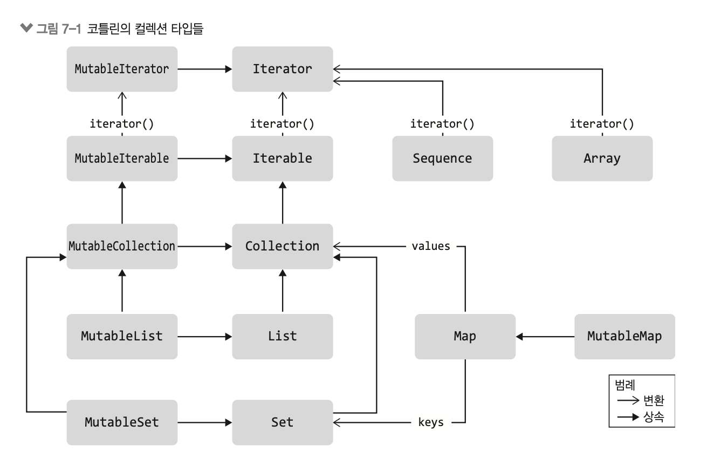

# 6. 컬렉션과 I/O 알아보기
- 컬렉션, 파일 I/O 스트림

##  6.1 컬렉션
- 컬렉션 라이브러리와 컬렉션과 컬렉션 안에 저장된 데이터를 조작하기 위한 종합적인 API가 포함 되며 걸러내기, 집계하기, 변환, 순서 지정 등의 데이터 조작이 가능
- **컬렉션을 조작하는 모든 연산이 인라인 함수** -> 따라서 이런 연산을 사용해도 함 수 호출이나 람다 호출에 따른 부가 비용이 들지 않는다

### 6.1.1 컬렉션 타입
- 컬렉션 타입의 종류
    - Array
    - Iterable
    - Sequence
    - Map

컬렉션 타입은 Generic Type 이다.
<p></p>

**이터러블**
- 코틀린에서는 **불변** 컬렉션과 **가변** 컬렉션을 구분하는 특징이 존재함.
- 즉시 계산 : 컬렉션이 생성될 때 초기화 된다, 나중에 필요할 때 계산되지 않음
- 상태가 존재함(stateful) : 원소를 저장한 상태로 유지, 원소를 동적으로 생성하지 않음
- 이터레이터 제공 : `iterator()` 메서드를 통해 이터러블 객체는 순회할 수 있는 메서드를 제공
- iterator 도 자바처럼 `hasNext()` , `next()` 메서드를 사용하여 원소를 순차적으로 탐색 가능 `remove()` 는 MutableIterator에만 존재한다.

- 자바와의 차이점 :
    - 불변과 가변 컬렉션 구분
        - 불변컬렉션 : 원소 추가/삭제 불가
        - 가변컬렉션 : 원소 추가/삭제 가능
    - MutableIterable : 가변 이터러블은 `MutableIterable`로 표현되며 MutableIterator 를 사용해 원소 수정
    - 코틀린의 공변성(Covariance)
        - 코틀린에서는 `Iterable<T>` 타입이 공변성을 가집니다.
        - `T`가 `U`의 하위 타입일 때 `Iterable<T>`는 `Iterable<U>`의 하위 타입이다.
            ```kt
            // 불변컬렉션의 경우
            fun processCollection(c: Iterable<Any>) {...}
            
            fun main() {
                val list = listOf("a", "b", "c") // List<String>
                processCollection(list) // Ok: List<String>을 List<Any>로 전달 가능
            }


            // 가변컬렉션의 경우
            fun processCollection(c: MutableCollection<Any>) {
                c.add(123) // 잘못된 동작 발생 가능
            }

            fun main() {
                val list = arrayListOf("a", "b", "c") // ArrayList<String>
                processCollection(list) // 컴파일 에러 발생
            }
            ```
**컬렉션, 리스트, 집합**

**1. 컬렉션(Collection)**
- Collection은 여러 원소를 모아놓은 자료 구조로, Iterable을 상속받아 순회할 수 있습니다.
- `Collection` 인터페이스로 표현되는 타입, Collection 타입의 하위 타입인 `MutableCollection` 인터페이스로 표현되는 타입 두가지가 존재함.
- 리스트는 인덱스를 통한 원소접근이 가능한, 순서가 정해진 원소 컬렉션
- 선형시간(On) 걸리는 `LinkedList` 가 대표적
- 집합은 유일한 원소들로 이루어진 컬렉션
    - `HashSet`
        - 해시 테이블 기반 구현
        - 원소의 해시코드에 따라 원소의 순서가 정해짐
    - `LinkedHashSet`
        - 해시 테이블 기반
        - 삽입 순서를 유지하기 때문에 Iterable 하면 집합에 삽입된 순서대로 순회 가능
    - `TreeSet`
        - 이진검색트리(binary Search Tree) 기반
        - 비교 규칙에 따라 일관성있는 원소 순서 제공
        - 원소가 Comparable 인터페이스를 상속한 경우 원소 타입이 이런 비교 규칙을 정의할 수 있고, 별도의 `Comparator` 객체를 통해 비교 규칙을 제공
**2. 시퀀스**
- iterator() 메서드 제공: 이터러블과 마찬가지로 `iterator()` 메서드를 제공해 순회할 수 있습니다.
- 지연 계산: 시퀀스는 처음부터 원소를 모두 계산하지 않고, 원소가 필요할 때 그때그때 계산합니다.
    - 즉, 컬렉션의 모든 원소가 한 번에 메모리에 저장되지 않기 때문에 메모리 효율적입니다.
    - 지연 계산을 통해 대량의 데이터를 처리할 때 성능 이점이 있습니다.
- 상태가 없음: 대부분의 시퀀스는 상태(state)가 없는 구조입니다. 이는 시퀀스가 원소를 계산한 후 따로 저장하지 않고, 필요할 때마다 다시 계산한다
- 시퀀스 구현은 내부적이므로 외부에서 직접 사용할 수 없다
- `asSequence()`를 확장 함수로 제공하며, 이 함수는 자바 스트림을 감싸서 코틀린 시퀀스로 사용하게 해준다
    - 자바의 스트림과 유사하게 사용할 수 있습니다.
```kotlin
// List를 시퀀스로 변환하여 사용
val list = listOf(1, 2, 3, 4, 5)
val sequence = list.asSequence()

// 시퀀스는 필요할 때 원소를 계산하여 처리
val result = sequence
    .filter { it % 2 == 0 } // 짝수만 필터링
    .map { it * 2 } // 짝수를 2배로 만듦
    .toList() // 최종 결과를 다시 리스트로 변환

println(result) // [4, 8]
```

**3. Map**
- key 와 value 쌍으로 이루어진 집합
- 단, key 는 유일해야 한다.
- Map은 `Collection`의 하위 타입은 아니지만 내부 원소들을 컬렉션처럼 사용할 수 있다.
- 키-값 쌍은 `Map.Entry` 와 `MutableMap.MutableEntry` 인터페이스로 표현된다.
- 맵의 표준 구현의 종류
    - HashMap, LinkedHashMap, TreeMap 
    - 직접 맵을 구현하고 싶다면 `AbstractMap`과 `AbstractMutableMap` 클래스를 기반 클래스로 사용

### 6.1.2 Comparable 과 Comparator

- 컬렉션의 정렬이나 순서가 중요한 다양한 연산에서 활용

Comparable 인터페이스
- 자연스러운 순서(Natural Order): Comparable을 구현하면 객체의 자연스러운 순서를 정의가능. 
    - 동일한 타입의 다른 객체와 비교할 때 사용하는 compareTo() 메서드를 통해 이루어집니다.
- 연산자 사용: Comparable을 구현하면 <, >, <=, >=와 같은 비교 연산자를 객체에 사용할 수 있습니다.
- 예시: Person 클래스를 전체 이름(fullName) 기준으로 자연스러운 순서를 부여하고 싶다면 다음과 같이 구현합니다.
```kt
class Person(
    val firstName: String,
    val familyName: String,
    val age: Int
) : Comparable<Person> {
    val fullName get() = "$firstName $familyName"

    override fun compareTo(other: Person): Int {
        return fullName.compareTo(other.fullName)
    }
}
```
- `compareTo()` 메서드의 관례:
    - 현재 객체가 인자보다 크면 양수 반환
    - 같으면 0 반환
    - 작으면 음수 반환
- 일관성 유지: `compareTo()`의 구현은 `equals()` 메서드와 의미적으로 일치해야 합니다.

Comparator 인터페이스
- 다양한 비교 방법 지원: 한 클래스를 여러 기준으로 정렬해야 할 때 Comparator를 사용. 
- 예를 들어, Person 객체를 나이, 성(last name), 또는 기타 프로퍼티 조합으로 정렬할 수 있습니다.
- Comparator 생성: Comparator<T>는 두 개의 T 타입 객체를 비교하는 compare() 메서드를 제공합니다.
- 람다를 통한 간결한 구현: Kotlin에서는 람다식을 사용하여 `Comparator`를 쉽게 생성 가능
```kt
val ageComparator = Comparator<Person> { p1, p2 ->
    p1.age.compareTo(p2.age)
}
```
- 도우미 함수 사용: compareBy()나 compareByDescending() 함수를 사용하여 더욱 간단하게 비교기를 만들 수 있습니다.
```kt
val ageComparator = compareBy<Person> { it.age }
val reverseAgeComparator = compareByDescending<Person> { it.age }
```
- 적용 예시: 생성한 `Comparator`는 `sorted()`, `max()` 등 순서를 필요로 하는 함수에 전달하여 사용

정리
- Comparable 구현: 객체의 자연스러운 순서를 정의하고 싶을 때 사용합니다.
- Comparator 활용: 여러 가지 기준으로 객체를 비교해야 할 때 유용합니다.
- 일관성 유지: compareTo()와 equals() 메서드의 구현은 논리적으로 일치해야 합니다.


### 6.1.3 컬렉션 생성하기

1. 생성자를 사용한 컬렉션 생성
- java와 유사한 방식으로 컬렉션 클래스의 생성자를 직접 호출하여 인스턴스를 생성

```kt
val list = ArrayList<String>()
list.add("red")
list.add("green")
println(list) // 출력: [red, green]

val set = HashSet<Int>()
set.add(12)
set.add(21)
set.add(12) // 중복된 값은 무시됨
println(set) // 출력: [12, 21]

import java.util.TreeMap
val map = TreeMap<Int, String>()
map[20] = "Twenty"
map[10] = "Ten"
println(map) // 출력: {10=Ten, 20=Twenty}
```

2. 컬렉션 함수를 사용한 생성
- 리스트와 집합 생성 함수
    - `emptyList()` / `emptySet()` : 빈 불편 리스트나 집합을 생성
    ```kt
    val emptyList = emptyList<String>()
    println(emptyList) // 출력: []
    emptyList.add("abc") // 오류: 불변 리스트에 요소를 추가할 수 없음
    ```
    - `listOf()` / `setOf()` : 제공된 요소로 구성된 불변 리스트나 집합을 생성합니다.
    ```kt
    val singletonSet = setOf("abc")
    println(singletonSet) // 출력: [abc]
    singletonSet.remove("abc") // 오류: 불변 집합에서 요소를 제거할 수 없음
    ```
    - `listOfNotNull()` : `null`이 아닌 요소들로만 구성된 불변 리스트를 생성합니다.
    ```kt
    val list = listOfNotNull("a", null, "b", null, "c")
    println(list) // 출력: [a, b, c]
    ```
    - `mutableListOf()` / `mutableSetOf()` : 가변 리스트나 집합을 생성합니다.
    ```kt
    val mutableList = mutableListOf("abc")
    println(mutableList) // 출력: [abc]
    mutableList.add("def")
    mutableList[0] = "xyz"
    println(mutableList) // 출력: [xyz, def]
    ```